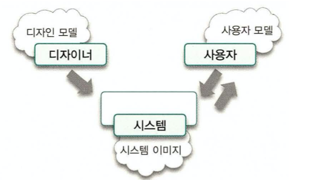
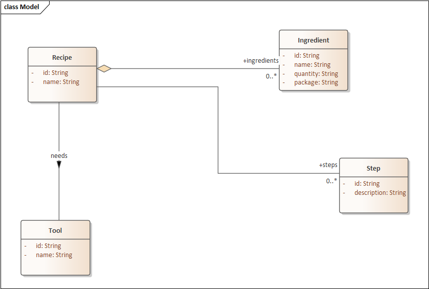

# 06 객체지도

## 길을 찾는 방법

다른 사람에게 길을 물어보는 방법 vs 지도를 이용하는 방법

- 다른 사람에게 길을 물어보는 방법
    - 현재의 요구만 만족시킬 수 있음 (A → B 로만 갈 수 있음)
    - 길을 찾는데 구체적인 기능을 제공한다.
    - 기능적이고 해결 방법 지향적인 접근법

```java
public static void main(String[] args) {
	int x, y;
	// B마을로 이동
	x += 4;
	y -= 1; 
	// 재사용 불가, 변경에 취약
	// 절차지향 프로그래밍
}
```

- 지도를 이용하는 방법
    - 다양한 목적을 위해 재사용될 수 있음 (A → B 가는 방법 뿐만 아니라 A → C, B → C 등 가능), 범용적임
    - 구조적이고 문제 지향적인 접근법

```java
public static void main(String[] args) {
	Location currentLocation = new Location();
	Map map = new Map(); //지도
	Location bTownLocation = map.bTownLocation();
	// B마을로 이동
	currentLocation.x = bTownLocation.x;
	currentLocation.y = bTownLocation.y;
	// 재사용 가능, 변경에 유연
	// 객체지향 프로그래밍
}
```

<aside>
💡 지도 은유의 핵심은 **기능이 아니라 구조를 기반으로 모델을 구축하는 편**이 **좀 더 범용적이고 이해하기 쉬우며 변경에 안정적**이라는 것이다.

</aside>

요구사항은 계속 변하기 때문에 모델이 제공하는 기능도 지속적으로 변할 수 밖에 없다.

따라서 **기능을 중심으로 구조를 종속시키는 방법**은 **범용적 ❌, 재사용 ❌, 변경에 취약**하다.

## 기능 설계 vs 구조 설계

- 기능 측면의 설계
    - 제품이 사용자를 위해 **무엇을 할 수 있는지**에 초점을 맞춤
    - 시스템 기능은 더 작은 기능으로 분해되고 각 기능은 서로 밀접하게 관련된 하나의 덩어리로 이루어진다.
    - 변경될 경우 기능의 축을 따라 설계된 소프트웨어가 **전체적으로 요동**치게 된다.

- 구조 측면의 설계
    - 제품의 **형태가 어떠해야 하는지**에 초점을 맞춘다.
    - 시스템 기능을 객체 간의 **책임으로 분배**한다.
    - 시스템 기능은 더 작은 책임으로 분할되고 적절한 객체에게 분배되기 때문에 **기능이 변경되더라도 객체 간의 구조는 그대로 유지**된다.
    

→ 요구사항은 **예측 불가능**하게 변경됨

→ 이를 대비하는 가장 좋은 방법은 **변경을 예측하는 것이 아니라** **변경을 수용할 수 있는 선택의 여지를 설계에 마련해 놓는것**

## 두 가지 재료: 기능과 구조

객체지향 세계를 구축하기 위해서는 사용자에게 제공할 `기능` 과 기능을 담을 안정적인 `구조` 라는 재료가 준비돼 있어야 함

- 구조는 사용자나 이해관계자들이 도메인(domain)에 관해 생각하는 **개념과 개념들 간의 관계**로 표현한다.
- 기능은 사용자의 목표를 만족시키기 위해 **책임을 수행하는 시스템의 행위**로 표현한다.

## 안정적인 재료: 구조

- **도메인**: 사용자가 프로그램을 사용하는 특정 대상 분야 (ex. 은행, 게임 등)
- **도메인 모델:** 도메인과 관련된 지식을 선택적으로 단순화하고 의식적으로 구조화한 형태

→ 도메인 모델은 소프트웨어에 대한 **멘탈 모델**이라고도 부름

도널드 노먼의 멘탈 모델



- **사용자 모델**: 사용자가 제품에 대해 가지고 있는 **개념들의 모습**
- **디자인 모델**: 설계자가 마음속에 갖고 있는 시스템에 대한 **개념화**
- **시스템 이미지:** 최종 제품

위의 3가지 측면을 모두 모델링할 수 있는 패러다임이 바로 **객체지향**이다.

**객체지향을 사용**하면 사용자들이 이해하고 있는 **도메인의 구조와 최대한 유사하게 코드를 구조화**할 수 있다.

객체지향의 패러다임은 **사용자의 관점, 설계자의 관점, 코드의 모습**을 모두 유사한 형태로 유지할 수 있게 하는 프로그래밍 기법을 제공함

### 표현적 차이

- 소프트웨어 객체는 현실 객체를 모방한 것이 아니라 **은유를 기반으로 재창조한 것**
- 소프트웨어 객체는 현실 객체가 갖지 못한 특성을 가질 수도 있고 현실 객체가 하지 못하는 행동을 할 수도 있음
- 이처럼 소프트웨어 객체와 현실 객체 사이의 의미적 거리를 가리켜 **표현적 차이** 또는 **의미적 차이**라고 함

그래서 표현적 차이가 무슨상관인가?

- **도메인 모델**을 기반으로 설계하고 구현하는 것은 **사용자가 도메인을 바라보는 관점을 그대로 코드에 반영**할 수 있게 함
- 결과적으로 **표현적 차이는 줄어들 것**이며, 사용자의 **멘탈 모델이 그대로 코드에 녹아 스며들 것**

**객체지향 → 도메인 모델 구현 → 표현적 차이가 줄어들음 → 도메인에 대한 사용자의 관점이 반영됨** 

왜 사용자가 도메인을 바라보는 관점을 그대로 코드에 반영해야할까?

### ****불안정한 기능을 담는 안정적인 도메인 모델****

도메인에 대한 사용자의 관점을 반영해야 하는 이유는 **사용자들이 누구보다도 도메인의 ‘본질적인’ 측면을 가장 잘 이해하고 있기 때문**이다.

**사용자 모델에 포함된 개념과 규칙은 변경될 확률이 적기 때문에** 사용자 모델을 기반으로 설계와 코드를 만들면 **변경에 쉽게 대처**할 수 있는 가능성이 커진다.

이는 도메인 모델이 기능을 담을 수 있는 안정적인 구조를 제공할 수 있음을 의미한다.

**객체지향 → 도메인 모델 구현 → 표현적 차이가 줄어들음 → 도메인에 대한 사용자의 관점이 반영됨 → 변경에 쉽게 대처할 수 있음**

즉, 안정적인 구조를 제공하는 도메인 모델을 기반으로 SW 구조를 설계하면 변경에 유연하게 대응할 수 있다.

도메인 모델 예시

![Untitled]
## 불안정한 재료: 기능

> 도메인 모델이 도메인과 관련된 중요한 개념과 관계를 보여준다고해도 실제로 사용자에게 중요한건 **소프트웨어의 기능**이다.
> 

> 객체지향 커뮤니티에서는 소프트웨어의 기능을 기술하기 위해 **유스케이스**라는 유용한 기법을 사용해왔다.
> 

### 유스케이스

- 유스케이스(Use Case): **사용자의 목표**를 달성하기 위해 사용자와 시스템 간에 이뤄지는 **상호작용의 흐름**을 텍스트로 정리한 것.
    - **사용자의 목표**를 충족시키기 위해 연관된 시나리오의 집합을 표현함
    
    ```java
    유스케이스명: 암안두팀이 스크럼을 진행한다.
    
    일차 액터: 스크럼 마스터
    
    주요 성공 시나리오:
    	1. 스크럼 마스터 주관하에 각자 어제, 오늘 할 일, 이슈 등을 말한다.
    	2. 스크럼 마스터의 코드를 공유해 코드 리뷰를 진행한다.
    	3. 코드 기록 일지를 작성한다.
    	4. 해산!을 외친다
    
    확장:
    	4a. 해산!을 외치지않고 바로 탈주할 수 있다.
    ```
    
    - 유스케이스의 5가지 특성
        1. 유스케이스는 사용자와 시스템 간의 **상호작용**을 보여주는 ‘텍스트’다. (다이어그램 x)
        2. 유스케이스는 하나의 시나리오가 아니라 **여러 시나리오들의 집합**이다.
        3. 유스케이스는 단순한 feature 목록과 다르다. 상호작용 흐름 속에서 시스템의 기능에 대해 의사소통할 수 있는 문맥을 얻을 수 있다. (2,3 시나리오 묶어 기능에 대한 문맥을 알 수 있음)
        4. 사용자 인터페이스와 관련된 **세부 정보를 포함하지 말아야한다**. 즉, 시스템의 행위에 초점을 맞춘다
        5. 유스케이스는 **내부 설계와 관련된 정보를 포함하지 않는다**. (내부 설계 설명 **❌**)
        

유스케이스는 단지 사용자가 바라보는 시스템의 **외부 관점만을 표현**하는 것일 뿐, 시스템의 **내부 구조나 실행 매커니즘에 관한 정보는 전혀 제공하지 않는다.**

- 따라서 **객체의 구조나 책임에 대한 정보도 전혀 제공하지 않는다.**

## 재료 합치기: 기능과 구조의 통합

### 도메인 모델, 유스케이스, 그리고 책임-주도 설계

> **불안정한 기능**을 **안정적인 구조 안에 담음**으로써 **변경에 대한 파급효과를 최소화**하는것은 휼륭한 객체지향 설계자가 갖춰야 할 기본적인 설계 능력이다.
> 

**변경에 유연한** 소프트웨어를 만들기 위해서는 **유스케이스에 정리된 시스템의 기능을 도메인 모델을 기반으로 한 객체들의 책임으로 분배**해야 한다.

- 책임-주도 설계 방법은 2가지 기본 재료인 유스케이스와 도메인 모델을 통합한다

1. 유스케이스로부터 **시스템이 제공해야 할 기능을 파악**한다. 시스템의 기능은 곧 시스템의 책임이 되며, 시스템은 해당 메시지를 받는 거대한 객체라고 가정한다.

ex) 시스템은 `스크럼을 진행한다.` 라는 기능을 제공해야 한다.

1. 시스템의 **책임을 작은 규모의 객체들이 수행할 책임으로 분배**한다. 이 때 안정적인 도메인 모델을 기반으로, 메시지를 받을 객체를 선택하고, 그 객체가 다른 객체에 전송할 메시지를 식별함으로써 자율적인 객체들의 협력 관계를 창조한다. (책임-주도 설계)

ex) 스크럼 마스터는 팀원들에게 스크럼을 진행한다는 메세지를 전달할 책임이 있다. 

팀원들은 자신의 일정 및 이슈를 전달할 책임이 있다.

스크럼 마스터는 팀원들에게 코드를 전달해 리뷰를 요청한다. 

팀원들은 코드를 전달받아 리뷰한 내용을 반환한다.

1. (객체와 책임이 식별됐으므로) **객체를 클래스로, 책임을 클래스의 메서드로 변환함으로써 구현**한다.(간단하게, 도메인 모델의 속성을 클래스의 인스턴스 변수로, 협력 안에서의 책임을 메서드로 변환할 수 있다.)

```java
class ScrumMaster{
	Code code;

	void 스크럼을_진행한다(List<Member> members){
		members.forEach(member -> member.setIsTurn(true));
		...
	}

	void 팀원들에게_코드를_전달한다(List<Member> members){
		List<Review> reviews = members.stream().map(member -> member.코드_리뷰를한다(code)).collect(toList());
		...
	}
 
}
```

```java
class Member{
	Schedule schedule;
	Issue issue;
	boolean isTurn;
	
	Content 일정_이슈를_공유한다(){
		Contnet content = new Content(schedule, issue);
		... 
		return content;
	} 

	Review 코드_리뷰를한다(Code code) {
		Review review = new Review(code);
		...
		return review;
	}
}
```

### ****기능 변경을 흡수하는 안정적인 구조****

****도메인 모델이 구성하는 요소의 특징****

- 도메인 모델을 구성하는 개념은 비즈니스가 없어지거나 완전히 개편되지 않는 한 안정적으로 유지된다.
    - 팀원들의 일정(스케줄)은 데브코스가 끝나지 않는 한 안정적으로 유지된다.

- 도메인 모델을 구성하는 개념 간의 관계는 비즈니스 규칙을 기반으로 하기 때문에 비즈니스 정책이 크게 변경되지 않는 한 안정적으로 유지된다.
    - 스크럼 마스터와 코드와의 관계는 핵심비즈니스 규칙(스크럼 마스터는 팀원들에게 코드를 전달해 리뷰를 요청한다)이 변경되지 않는 한 동일하게 유지된다.

비즈니스 정책이나 규칙이 크게 변경되지 않는 한 시스템의 기능이 변경되더라도 **객체 간의 관계는 일정하게 유지**된다. 

기능적인 요구사항이 변경될 경우 **책임과 객체 간의 대응 관계만 수정**될 뿐이다. 

이는 변경에 대한 **파급효과를 최소화**하고 **요구사항 변경에 유연하게 대응**할 수 있는 시스템을 구축할 수 있게 한다.